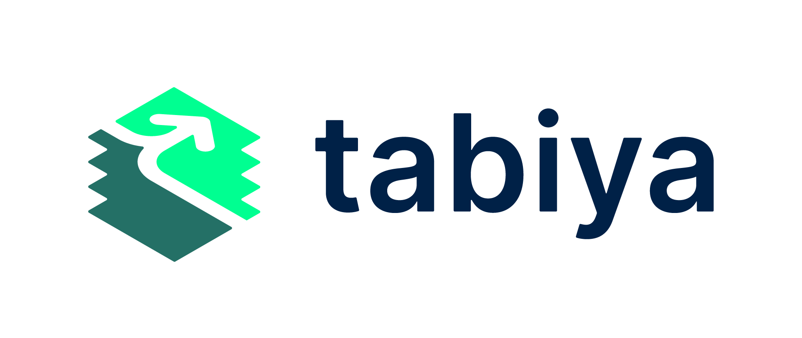

# Welcome

<figure><picture><source srcset=".gitbook/assets/Tabiya_Logo_RGB_Monochrome_ImageWord_Dark.png" media="(prefers-color-scheme: dark)"></picture><figcaption></figcaption></figure>

**Tabiya creates open-source software, models and standards to help tackle the global youth employment challenge.**

We foster research, coordination, and harmonization among partners that create learning and career pathways.

Our vision is to unlock human capital and empower people in informal and formal labor markets.

## Discover Tabiya's Work

<table data-view="cards"><thead><tr><th></th><th></th><th></th><th data-hidden data-card-target data-type="content-ref"></th><th data-hidden data-card-cover data-type="files"></th></tr></thead><tbody><tr><td><strong>Inclusive Livelihoods Taxonomy</strong></td><td>Make visible and usable the human capital of everyone in an economy</td><td></td><td><a href="projects/inclusive-livelihoods-taxonomy/">inclusive-livelihoods-taxonomy</a></td><td></td></tr><tr><td><strong>Compass by Tabiya</strong></td><td>Assist job-seekers in exploring and discovering their skills</td><td></td><td><a href="https://app.gitbook.com/o/R1Wzhnch8nFln8aM1Aec/s/0O0RbZr6qGsjDH7HKDCo/">Compass</a></td><td></td></tr><tr><td><strong>Inclusive Livelihoods Classifier</strong></td><td>Use natural language processing to automatically process unstructured text from jobseeker profiles and vacancies </td><td></td><td></td><td></td></tr></tbody></table>

If you have any questions or comments, please do not hesitate to reach out via [email](mailto:hi@tabiya.tech). You can also create an [issue](https://github.com/tabiya-tech/docs/issues) in the [Github repository](https://github.com/tabiya-tech/docs/) that hosts this documentation.
