# Compass Customization Guide

Compass supports **white-label customization**, allowing partners to adapt branding, features, language, and data collection so the application looks and feels like their own product.

This guide explains what you can customize and how those changes affect the application.

### Branding

Update the application name, logos, icons, and colors to match your organization’s identity. You can also set search engine details to control how your site appears online.

**Identity**

<figure>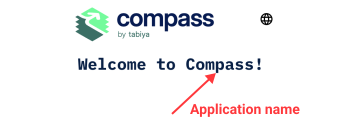<figcaption>
<em>Application identity</em>
</figcaption></figure> <figure>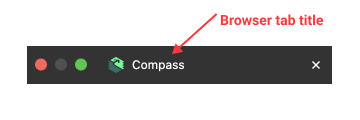<figcaption></figcaption></figure>

**Assets**

<figure>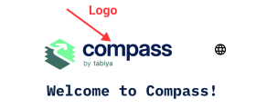<figcaption>
<em>Logo and icon assets</em>
</figcaption></figure> <figure>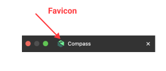<figcaption></figcaption></figure> <figure>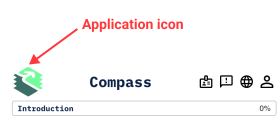<figcaption></figcaption></figure>

**Colors**

<figure>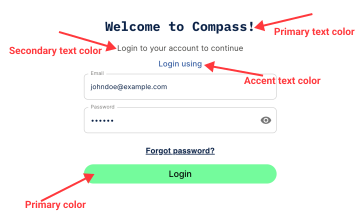<figcaption>
<em>Branding colors</em>
</figcaption></figure>

### Authentication 

Decide how users log in. You can configure the authentication process by enabling or disabling login or registration codes.

<figure>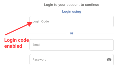<figcaption>
<em>Login and registration with code enabled</em>
</figcaption></figure> <figure>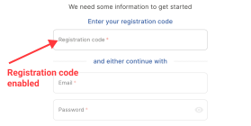<figcaption></figcaption></figure>

### CV Features 

Turn the CV functionality on or off. If disabled, all CV‑related options disappear from the application.

<figure>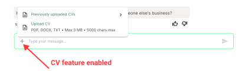<figcaption>
<em>CV feature enabled</em>
</figcaption></figure>

### Skills Report 

Add your logo(s) to the report, choose the available download formats (PDF or DOCX), and decide which sections are included in the report, including the summary and experience details.

<figure>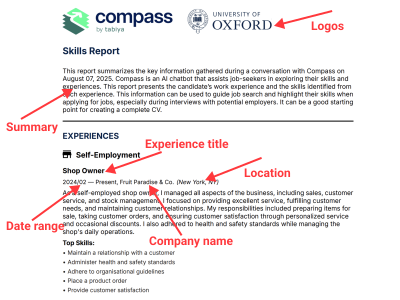<figcaption>
<em>Skills report customization</em> 
</figcaption></figure>

### Languages

Select the default language for the application and choose which additional languages users can switch to.

<figure>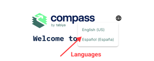<figcaption>
<em>Language switcher interface</em>
</figcaption></figure>

### Sensitive Data

Define which personal information Compass collects from users. Available fields include:

* Name
* Contact Email
* Gender
* Age
* Education Status
* Main Activity

Each field can be customized to match your organization’s requirements and translated into supported languages.

<figure>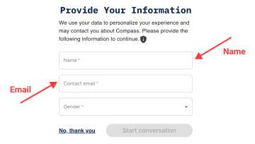<figcaption>
<em>Sensitive data fields</em>
</figcaption></figure>

### How It Works 

Customization is controlled through settings provided during deployment. These settings are passed into Compass automatically and applied across the application once the deployment is complete.

### Important Notes 

* Only the options listed above can be customized. Core workflows and layouts stay the same.
* If a customization setting is missing or entered incorrectly, Compass will ignore it and use the default settings instead.
* Colors must meet accessibility standards so all content remains readable.
