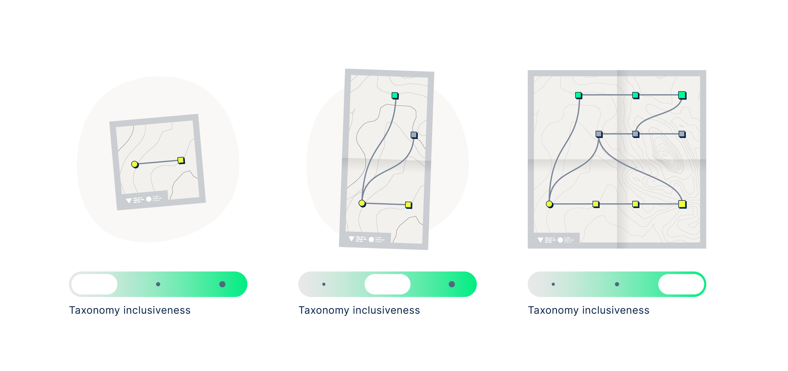

# Inclusive Livelihoods Taxonomy

## Understanding Human Capital

Human capital—the collective skills, knowledge, and experiences of individuals—is a key driver of economic productivity and income potential. The extent of an individual's human capital often determines their earning ability and is deeply tied to human agency, or the capacity to make independent decisions and shape one's life. Recognizing and valuing all forms of human capital is essential for creating inclusive economic opportunities.

The motivation for our work is described well by a quote from one our key partners, [Harambee Youth Employment Accelerator](https://www.harambee.co.za):

> _<mark style="color:orange;">Young people in South Africa often lack the resources, networks, education and work experiences needed to be considered for formal employment. But, in the past 12 years, our work at Harambee has taught us that young people have the potential to perform in these jobs if we give them a chance! What if a young person was better able to identify and articulate the skills they have gained outside of the formal economy? What if they could signal skills gained from unpaid work?</mark>_
>
> _**Harambee Youth Employment Accelerator, South Africa**_

## Problem: Traditional Frameworks Overlook Parts of the Economy

Organizations supporting young people in accessing economic opportunities often use structured frameworks to define available opportunities and the skills, competencies, and qualifications required. However, most widely used labor market taxonomies fail to capture the diverse economic contributions of individuals. These frameworks, such as the **System of National Accounts (SNA)**—an international standard for measuring national economic activity—primarily account for formal, market-based transactions.

<mark style="color:blue;">The System of National Accounts: What does it include, what does it exclude?</mark>

The [System of National Accounts (SNA)](https://unstats.un.org/unsd/nationalaccount/sna.asp) serves as an international statistical standard for the measurement of economic activities. This methodological framework, employed by various countries around the globe, guides the production, interpretation, and use of internationally comparable economic statistics. The SNA's existence is predicated on the need to standardize and simplify the complex nature of economic transactions. It functions as an economic map, describing the interconnections between different economic actors (households, businesses, government), their activities (consumption, production, investment), and the overall performance of an economy.&#x20;

One key element in the SNA is the concept of the "production boundary." The production boundary delineates the transactions that are accounted for in the calculation of Gross Domestic Product (GDP) and other key economic indicators.&#x20;

However, many forms of human capital investment and productivity remain outside these traditional boundaries, including household labor, volunteer work, and informal employment. These activities play a crucial role in economic development and individual livelihoods yet remain undervalued because they do not generate direct monetary compensation. We refer to these overlooked activities as the **"unseen economy"**.

<figure><figcaption>
Partners that help young people find jobs typically use a taxonomy to describe the universe of jobs in an economy and the anatomy of each job. Such a “map” of the labor market can help young people find escalators and elevators to better livelihoods. If the map is incomplete or inaccurate, it may limit young people’s ability to find the right jobs. <strong>We aim to expand the map to include the full range of diverse livelihoods that young people pursue, including those in the "unseen economy".</strong>
</figcaption></figure>

### **Recognizing the "Unseen Economy"**

The "unseen" parts of the economy must be acknowledged to ensure a comprehensive understanding of human capital. **Seen** economic activities typically involve paid labor, whether formal or informal. **Unseen** activities, by contrast, include unpaid but productive work—such as caring for family members or performing household tasks—that could, in theory, be outsourced for payment. Notably, this definition excludes leisure, as one cannot pay someone to engage in leisure on their behalf.

Recognizing and accounting for the human capital in the unseen parts of the economy is vital for accurately representing people's contributions to the economy, and providing a basis for policies that protect and support all forms of work, thereby enhancing individual agency.

<mark style="color:blue;">Not making visible and usable human capital from the "unseen economy" can limit human agency in at least four ways</mark>

1. **Undervalued Skills & Experience:** Many skills gained in unpaid or informal work—such as budgeting, logistics, and negotiation—are highly transferable. However, when these activities are not recognized as productive, individuals (especially women, who disproportionately handle unpaid labor) face challenges transitioning into paid employment or receiving fair compensation. Contreras et al. (2024) show that listing household activities in surveys increases reported labor force participation, suggesting that clearer recognition of skills helps job seekers articulate their experience.
2. **Limited Economic Opportunities:** The lack of recognition and compensation for unpaid work leaves many without financial resources to invest in education, entrepreneurship, or career growth. This perpetuates income inequality, poverty, and restricted social mobility, limiting individual agency.
3. **Policy Blind Spots:** When unpaid and informal work is excluded from economic metrics, it is often overlooked in policy decisions. As a result, support structures like social security, healthcare, and labor protections typically focus on paid workers, leaving many without essential safety nets.
4. **Reinforcement of Gender Inequalities:** Women globally bear a disproportionate share of unpaid work, such as caregiving and household labor. The failure to value this work limits their participation in paid employment, skill development, and broader economic opportunities, reinforcing systemic gender disparities.&#x20;

## Our approach: Expanding the Map

Our mission is **to make visible and usable the human capital of everyone in an economy**.  This involves two related efforts:

1. **Making visible** all economic activity and the skills, knowledge, and experience gained through these activities, particularly those in traditionally "unseen" sectors, such as informal and unpaid work.
2. **Making usable** the skills, knowledge, and experience gained through these activities by integrating them into conventional labor market frameworks.

The first has long been explored in social science and economic research, a base that we continue to utilize and build upon through our own research. The second objective of making these unseen skills usable is accomplished by expanding the existing map of the labor market: **creating an inclusive reference taxonomy that partners can adapt and build upon.**&#x20;

<mark style="color:blue;">What is a reference taxonomy and why is it important?</mark> 

A well-structured taxonomy provides a common language to categorize, interpret, and link various labor market data points. It serves as a **map of the labor market**, outlining the full spectrum of jobs in an economy and the competencies, skills, and qualifications required for each. These taxonomies serve as a foundation for governments, nonprofits, and other stakeholders to offer more effective career guidance and employment services. Below, we outline various use cases for this taxonomy.&#x20;

* **Matching:** A reference taxonomy bridges labor market supply and demand by standardizing and categorizing skills and qualifications. It helps match job seekers to roles by aligning employer requirements with candidates' capabilities.
* **Career Guidance & Skill Development:**  A reference taxonomy can be used for tailored guidance to jobseekers, highlighting required skills for specific roles and suggesting alternatives based on transferable competencies.
* **Data Analysis & Insights:** Standardized classification of skills, qualifications, and job titles enables meaningful labor market analysis, revealing trends, in-demand skills, and industry hiring patterns.
* **Policy & Research:** A unified classification system supports policymakers and researchers by enabling consistent labor market comparisons across industries, regions, and time, aiding workforce planning and education strategies.

With Tabiya's **Inclusive Livelihoods Taxonomy**, we aim provide a more inclusive map of the labor market – one that includes activities from the "unseen economy." A more inclusive map of the labor market will allow more inclusive matching, the identification of more diverse career and skill development pathways, and richer data analysis. [A more detailed description of our methodology can be found here](methodology.md) and our reference taxonomy can be accessed, adapted, and updated through our [Open Taxonomy Platform](open-taxonomy-platform.md).

