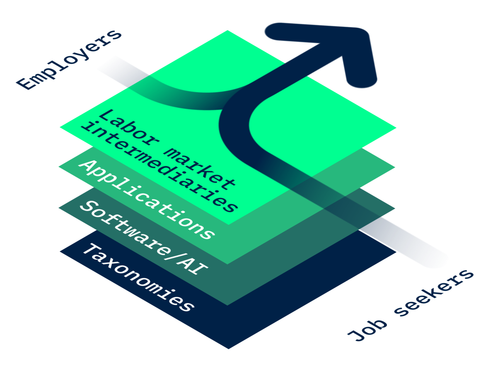

# About Tabiya

<figure><figcaption>
We aim to develop open-source technology and practical solutions to connect jobseekers with opportunities. The foundation of our work is a set of inclusive livelihoods taxonomies upon which partners can build applications that empower jobseekers.
</figcaption></figure>

## Our Vision

Tabiya is a research organization that develops open-source technology and practical solutions to connect jobseekers with opportunities. Our vision is one of inclusive labor markets that empower people by recognizing their formal and informal skills.&#x20;

> Tabiya, from Arabic طبيعة “essence”, is a chess opening position that serves as the starting point for many possible subsequent moves. It alludes to the starting point from which jobseekers may navigate the many different paths through labor markets. It may also be translated as “talent”, alluding to the human capital that young people are looking to build, protect, and utilize.

Our objective is to create software, models, and standards that help governments, nonprofits, grassroots organizations, education and training providers, and employers in low- and middle-income countries (LMICs) harness the promise of data and AI to create more equitable and more efficient labor markets while navigating the global challenges of digitalization and decarbonization.&#x20;

### Our Guiding Principles

Our work is based on the following four guiding principles:

1. **Public goods instead of walled gardens:** Rich private sector ecosystems for labor market intermediation are emerging in low-and middle-income countries, but with little to no integration, coordination, and harmonization of data. LMIC governments and non-profits find it difficult to tap into private sector ecosystems for analytics or build public good solutions for their labor markets. Off-the-shelf labor market information systems and AI-based analytics are exclusively geared at high-income country labor markets and are prohibitively expensive for LMIC applications.
2. **Standardization to foster integration, coordination, and harmonization:** Different labor market actors need to speak the same “language” – they need to use a common reference terminology for the labor market. This reference terminology needs to describe the universe of jobs in an economy and the anatomy of each job – the mix of skills, competences, qualifications required for the job. Such frameworks either do not exist for LMIC labor markets or are frequently outdated. A standardized framework is a key requirement to harness data across actors for large-scale data analysis and AI-based applications. At the same time, a taxonomy that does not reflect livelihoods in LMICs risks exacerbating existing inequities and raises concerns about algorithmic fairness.
3. **Rigorous evidence and research on equity, efficiency, or algorithmic fairness:** There is an emerging research agenda on the promise and perils of technology and AI for labor market intermediation in high-income countries, but challenges in LMICs are not well understood.&#x20;
4. **A neutral platform for open discussion, exchange, and learning:** Coordination and knowledge exchange on the promise and perils of technology for labor markets among public and private employment service experts and policymakers from LMICs is lacking. With our roots at the University of Oxford, we provide a neutral platform to make recent advances in data and AI-based technologies more widely available while rigorously scrutinizing algorithmic biases.

## The Global Youth Employment Challenge

Youth employment is already a pressing global challenge, with about 75 million young people unemployed and 280 million people not in employment, education, or training. In the next 10 years, more than 1 billion young people will enter the labor force, 700 million in Africa alone.&#x20;

Over the next decades, digitalization and decarbonization will further transform livelihoods in low- and high-income countries alike. Jobs in various sectors of the economy might disappear or change dramatically while new economic opportunities will be created elsewhere. Investing into human capital and formulating policy responses to digitalization and decarbonization will require evidence, and targeted advice and recommendations to empower jobseekers in their journeys through these changing labor markets.&#x20;

Academic research has additionally identified a range of labor market frictions that undermine the efficient allocation of workers to jobs in LMICs. Millions of youths in low-income countries face a “slippery job ladder”: As they try to climb up to better-paying jobs, they frequently fall back into low-wage work, informal self-employment, or unemployment. This unproductive churn traps them in poverty and exacerbates inequalities. Lack of information is one explanation for why the ladder is so slippery – jobseekers often don’t know how to best use their skills, and firms don’t know where to find the best workers – and that improving information can improve jobseeker outcomes.&#x20;

Improved data and AI systems promise to tackle these challenges but remain inaccessible and unaffordable to stakeholders in LMICs. Proprietary commercial solutions dominate the market but raise concerns about limited interoperability and contractual lock-ins (“walled gardens”). Where these tools are used, they often exclude large parts of the population in the thriving and diverse informal sector. This exacerbates existing, often strongly gendered, inequities.

## Context: Improving labor markets with technology can only be a small puzzle piece of the global youth employment challenge&#x20;

Online job matching platforms have emerged as popular tool for connecting employers and job seekers in an increasingly digital world. And indeed, there is now robust evidence that alleviating search and matching frictions by improving the flow of information between employers and jobseekers can improve labour market outcomes.&#x20;

Why intervene in the labor market when jobseekers typically have strong incentives to find jobs, and firms have strong incentives to find the right employees?

Jobseekers typically have strong incentives to find jobs, and firms have strong incentives to find the right employees. As [Carranza and McKenzie _JEP_ 2024](https://www.aeaweb.org/articles?id=10.1257/jep.38.1.221) show using Labor Force Survey data from a number of (largely middle-income) countries, public or private labor market intermediation services only help a tiny fraction of jobseekers find work.&#x20;

So what rationale is there to intervene in the free labor market and support job matching platforms and other innovative tech solutions that aim to reduce search and matching frictions?&#x20;

One important argument are equity concerns: We know that in many contexts, existing networks play a large role in who gets the few jobs that might be available. Underserved communities without these networks might fall short. Innovative, tech enabled solutions could, in theory, improve inclusion of these underserved groups if they provide information in a more equitable way. It remains, however, a question to what extend such platforms can truly improve economic inclusion for underserved groups. Not everyone has access to smartphones, the internet, or the necessary digital literacy to utilize these platforms effectively.&#x20;

A second argument might be that reducing information frictions can improve the reallocation of workers across sectors and space -- for example in contexts with rapidly changing demand in specific sectors. For example, the Ethiopian Investment Commission (EIC) – the Ethiopian government's investment promotion agency – worked with partners to set up a centralized sector-specific labor market information system to match a large supply of workers with specific jobs in the country's industrial parks.&#x20;

At the same time, it is important to note that information frictions only represent a very small part of the global youth employment challenge. While we believe that technology – if used well – can help overcome these frictions, they address merely the surface of deeper, structural issues – most importantly the lack of economic growth, insufficient job creation, and deeply rooted social and economic exclusion of specific groups. This broader economic context can render even the most efficient job matching platforms ineffective.&#x20;

Technology can thus only be part of a broader approach to solving global youth employment and promoting economic inclusion. It requires broad ecosystems of private sector, government, and civil society working together to tackle structural barriers on both sides of the market. Tabiya aims to contribute to these ecosystems with digital public goods that others can build on.
