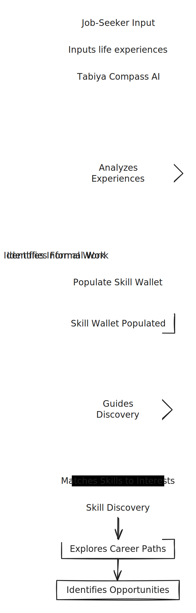

# Methodology

## Motivation of the Methodology

Now that Tabiya’s underlying frameworks have been described, the exercise of assigning skills as a human capital proxy for the unseen economy may commence. Tabiya builds on an existing “Counting Women’s Work” literature that assigns a monetary value to the unpaid, productive tasks done by women, generally in their homes. Tabiya’s work departs from this literature twofold. Our first departure lies in our emphasis on the skills gained in the unseen economy. Rather than the attachment of a monetary valuation to unseen economy skills, we use ESCO skills assigned to comparable or adjacent formal sector occupations to “value” unseen economy skills. In this way, the metric of comparison between seen economy occupations and unseen economy activities is skills. Secondly, we account for the entire working age population that participates in unseen economy activities, relative to only women.


**Counting Women's Work**: The necessity to better understand sex inequalities in the labor market led to the finding that while both men and women work, their work is valued differently, and this differential valuation yields a perceived differential “productive characteristic endowment” amongst sexes that, in turn, drives sex wage disparities for the African case. In particular, men generally perform paid labor market activities, while women perform both paid labor market and unpaid home production activities([Dinkelman & Ngai, 2022](https://www.aeaweb.org/articles?id=10.1257/jep.36.1.57)). Hence, a literature that seeks to count women’s work has emerged. This literature relies on time-use data to attribute an equivalent labor market wage to home production activities done by women ([Samarasinghe, 1997](https://books.google.co.uk/books?hl=en\&lr=\&id=TGdd8mY3heQC\&oi=fnd\&pg=PA129\&dq=counting+women%27s+work\&ots=7mx1tLfjvK\&sig=dx9mmtD3ZJbOLGHTURnOBr8nlJI\&redir\_esc=y#v=onepage\&q=counting%20women's%20work\&f=false); [Hoskyns and Rai, 2007](https://www.tandfonline.com/doi/full/10.1080/13563460701485268?casa\_token=V92z2s5OCJ4AAAAA%3Ac8Ty5sBz0GYyaJ8RBVbAvmNa7FAycOeVS4sGuxvapqLar8hHoY15BjJO-mAIoBr3-7ut8VHJtZ0VkA); [Donehower, 2018](https://static1.squarespace.com/static/5994a30fe4fcb5d90b6fbeab/t/5bac023d4785d3a47239adb2/1537999437377/CWW+WP4.pdf) and [Abrigo & Francisco-Abrigo, 2019](https://www.econstor.eu/handle/10419/211076)). For the South African case, this work’s results have found that if household work done predominantly by women were valued by its nearest specialized occupation, it would account for half of the nation’s aggregate labor income ([Oosthuizen, 2018](https://static1.squarespace.com/static/5994a30fe4fcb5d90b6fbeab/t/5baee9e8085229c69ad3840b/1538189818384/CWW+WP6.pdf)). Of course, if a given household activity can be equated to a specialized occupation, this implies that this activity comprises similar tasks to those performed in the specialized occupation. Then, by definition, the fact that tasks are an output of the application of a skill implies that at least some skills used outside of the market are comparable to those used in the market.


### Matching unseen ICATUS activities to the ESCO framework&#x20;

Ultimately, Tabiya conceptualizes a framework that links the most granular level of unseen economy ICATUS activities (3-digit level) to a set of non-exhaustive candidate ESCO skills and knowledge tags per ICATUS Activity. ICATUS 3 digit level activities comprise more specific activities that lie within ICATUS Divisions Three, Four, and Five. For example, “Preparing meals/snacks'' is a Group Level Activity that falls within the Division 3 of ICATUS, namely Unpaid domestic services for household and family members. In addition, at the Group Level, ICATUS includes a definition of each activity, and a non-exhaustive list of the tasks that each activity includes and does not include. Finally, ICATUS presents at least one example of each Group Level Activity. The relation of ICATUS to the South African Time Use Survey and the International Labour Organisation’s Forms of work is shown below. From this, it is evident that countries use the ICATUS taxonomy as a skeleton that they slightly amend their time use surveys from. Hence, one of the desirability of the ICATUS Framework for our purposes is its amenability to various national contexts’ time use surveys.

<figure><figcaption></figcaption></figure>

The ESCO taxonomy is made up of a set of occupations at level five or lower that are derived from the four ISCO-08 occupations hierarchy. For the purpose of the Tabiya Framework, we use only ESCO occupations at level five or lower for our analysis, since this provides the desirable granularity and metadata to adequately link ESCO to ICATUS. The ESCO taxonomy provides a brief description of each occupation it comprises, the occupation’s alternative labels as well as access to regulatory information pertaining to the occupation. What makes the ESCO taxonomy particularly desirable are the skills and competences it assigns to each occupation at level five or lower. These skills and competences include a predetermined list of essential and optional skills and competences, and a list of essential and optional knowledge required to perform a given occupation.&#x20;

ICATUS Group Level activities are used as one of the inputs for the matching procedure entailed in the Tabiya framework. ESCO occupations and skills, competences and knowledge (skills, competences and knowledge will be referred to as skills henceforth for simplicity) are used as the other input for the matching procedure. In particular, Each ICATUS Group Level activity is manually matched to at most four ESCO occupations by a team of researchers. ICATUS, even at the Group Level, is more broad than ESCO occupations and so, to ensure comprehensiveness in the Tabiya matching procedure, up to four ESCO occupations were potentially matched to each ICATUS Group Level activity. Since the ESCO taxonomy assigns skills to occupations, these ESCO-assigned skills then form the initial list of candidate assigned skills per ICATUS Group Level activity.&#x20;

The assignment of ESCO occupations to ICATUS activities is based on the relative similarity definitions between ICATUS Group Level activities, and ESCO occupations. Comparing definitions of ICATUS activities to ESCO occupations is relatively easy to do amongst a team of researchers, since activities and occupations are similar in nature, and in turn, in the manner that each of these are defined. Once at most four ESCO occupations are matched to each ICATUS Group Level activity by a team of at least two researchers, these matches are then checked by another independent researcher. Throughout this process, there were no instances where the independent researcher disputed an occupation without mutual agreement from the pair of researchers who initially made the match. This system is adopted to ensure that person-specific biases do not prevail during the matching process. This notwithstanding, while we endeavor to minimize biases and human error through this process, we cannot completely rule out the possibility that other (group level) biases and errors may have occurred throughout this process. Over time, as Tabiya accumulates more data and learns from this, the framework will use these learnings to improve and ultimately, not succumb to any currently prevailing biases and errors.

Once the ICATUS to ESCO occupations match is done and verified, the next stage of the Tabiya framework formulation can commence. By design, the ESCO taxonomy pre-assigns skills to each ESCO occupation at disaggregation level five and below. Thus, we exploit this structure for the Tabiya framework. In particular, once ICATUS activities are matched to ESCO Occupations, we adopt the pre-assigned ESCO skills as the first set of candidate skills assigned to each unseen economy ICATUS activity. Once duplicate skills are removed, each ICATUS activity now has a comprehensive list of skills assigned to it.  The procedure is shown below:

## Reducing the Candidate List of Skills

The taxonomy obtained following this method is hardly useable. Indeed, each ICATUS activty ended up being associated with numerous skills. In order to provide a manageable list of skills to job seekers on the Harambee platform 0.1, the team decided to reduce this temptative list of skills. reucing this also allowed to addressed the [transferability and signalling issues ](broken-reference)inherent to the unseen economy. To do so, an approach based on a Panel of professionals involved in the South-African labour market and in intermediation instances (among which Harambee) was chosen. The panel approach is meant to gain context-specific insights from a wide range of stakeholders. This would make it possible to overcomestake holders' biases pertaining to the transferatility and credibility of skills. In order to test this approach, we first implemented a panel at the scale of Harambee.

For the panel to happen efficiently (in a time limit of 5 hours for the pilot panel), the Tabiya team proceded to a first round of skill selection in order to delete skills that were deemed obviously not consistent with the definitiona nd description of ICATUS activities. To do so, the team followed 4 easily applicaable rules.&#x20;

#### Isolate Knowdleges

The ESCO classification distinguishes between "skills" - that all describe an action - and "knowledges". For instance, the occupation "cook" is asociated with the skill "use cooking techniques" and the knowledge "cooking technique". As a first step, we chose to isolate knowledges and to mainly focus on skills. However, we chose to let the panel decide to keep certain knowledges when they brought important new informations. For instance, "common children's diseases" may be deemed an essentio


The decision to isolate knowledges also relies on the observation that knowldges assigned with ESCO occupations are usually redundant with skills, i.e. their presencde in the list does not bring new information content. For instance, if a young job seeker "uses cooking techniques", this implies that they to know "cooking techniques".&#x20;


**Delete irrelevant skills:**

&#x20;In ICATUS, each activity is associated with a definition, and explicit list of tasks included in the activty, a list of tasks that are not included, and one or more examples. ESCO is built similarly. However, IACTUS activities are typically not only broader, but conceptually different from ESCO occupations. For instance, "Budgeting, planning, organizing duties and activities in the household" is not a formal sector activity that is included in ESCO. Therefore, to assign ESCO skills to this ICATUS activity, it was matched to "Office clerk", "Accountant", "Bed and breakfast operator", three ESCO occupations that encompass all tasks involved in "Budgeting, planning, organizing duties and activities in the household". The issue is that they encompass more. For instance, because of "bed and breakfast operator", the skill "serve beverages" endded up being associated to  "Budgeting, planning, organizing duties and activities in the household", even though serving atsks are not included in the description of the ICATUS activity. When we came across such cases, we decided to exclude the skills that had been unduly associated to the ICATUS activities.&#x20;


The difficulty when applying this rule came from our expectation of how youg job seekers would use the Harambee platform. Indeed, when selecting the ICATUS activty "preparing meals and snacks", one might mean that they prepare meals, serve them, and clean after. In ICATUS, those are three different activities, that are associated with different tasks, and thus skills. For version 0.1 of the Harambee platform, we chose to strictly fit the descriptions of each ICATUS activity, and to expect users to chose all relevant ICATUS activities. This choice was moivated by the observation that a more flexible approach would make a taxonomy inoperative, and make it more difficult to match job seekers to relevant job offers.&#x20;


* **Delete skills that are deemed too formal:** some of the skills associated with ESCO occupations directly refer to situations or tasks only imaginable in the seen economy, whether it is formal or informal. For instance, "maintain customer service" cannot be appropriately associated with "serving meals and snacks", as it describes serving meals and snacks to one's own children/family members.&#x20;


Applying this rule is entails having a very literal interpretation of ICATUS activities and the skills involved. For instance, one may argue that ensuring the satisfaction of family memers when serving a meal or a snack may allow someone to develop customer service skills.&#x20;


* **Delete redundant skills:** ESCO occupations are typically associated with numerous skills, and each ICATUS activity was associated with mutltiple ESCO occupations by Tabiya's team. The lists of skills from each ESCO activity was added to a list of skills for each ICATUS actity, with deletion of skills that appear multiple time (where we only kept one appearance). Therefore, the temptative lists of skills associated to each ICATUS activty contain skills tht may be deemed redundant. For instance, "Outdoor cleaning" was associated with both "prune plants" and "prune hedges and trees". We considered that asociating both skills to "outdoor cleaning" did not bring new information.&#x20;


Applying this rule proved tricky, as it highlighted the complexity of the ESCO taxonomy. For instance, "prune plants" does not contain the subsoil "prunde hedges and trees", even though hedges and trees are obviously plants. However, it contains the subskill "perform hand prunning". This shows that the organization of ESCO itself is not straighforward, and that cases exist where two skills conceptually very similar.&#x20;


\
This makes up the generalisable unseen economy framework methodology. From this candidate list of skills associated with each unseen economy ICATUS activity, differing contexts can begin to localize this framework.

\
\
\

