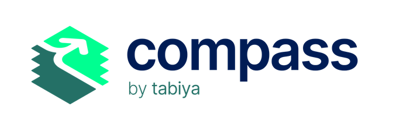

# Compass Overview

<figure><picture><source srcset="../../.gitbook/assets/compass_logo_web_light.png" media="(prefers-color-scheme: dark)"></picture><figcaption></figcaption></figure>

Compass is an innovative, AI-powered chatbot designed to revolutionize the way a young person identifies, articulates, and showcases their skills. Developed by Tabiya, Compass is a personal career assistant, helping youth uncover hidden talents and match them with the best opportunities in the job market.

## The Compass Solution

Compass is an open-source, conversational AI tool that:&#x20;

1. Engages in **natural dialogue to explore** your experience&#x20;
2. Analyzes a user's input to **identify and categorize skills** against localized [taxonomies](https://docs.tabiya.org/overview/projects/inclusive-livelihoods-taxonomy/open-taxonomy-platform)&#x20;
3. Identifies **skills from both formal and informal work**&#x20;
4. Creates **a comprehensive skills profile** tailored to the user&#x20;
5. Generates a **professional customizable CV** highlighting one’s strengths&#x20;
6. **Matches a user's skills** with relevant economic opportunities&#x20;
7. Recommends **personalized recommendations** for skill development and career advancement.&#x20;

Compass uses a large language model (LLM) and a conversational interface to help job seekers build a CV that highlights their skills. The tool combines a commercial LLM with a human-reviewed skills taxonomy for the labor market.&#x20;

## Addressing Critical Challenges

In today's rapidly evolving job market, Compass tackles two persistent and interconnected problems that hinder effective workforce development:&#x20;

* **Challenges in showcasing skills:** Crafting a CV that highlights relevant skills is tough for many job seekers. It's about translating experiences into terms that appeal to employers. This is harder for those with non-traditional or informal experience. A poor CV can lead to missed opportunities.
* **The scalability struggle:** Traditional methods rely heavily on human career counselors. While these professionals offer valuable insights, this approach has significant limitations.

Compass breaks down barriers by offering an AI solution that's scalable, affordable, and high-quality.

## Benefits of Compass

<table data-view="cards"><thead><tr><th></th><th></th><th></th></tr></thead><tbody><tr><td>
<em><strong>For Funders</strong></em>
<ul><li><strong>Scalable Impact:</strong> Reach thousands of job seekers efficiently with minimal cost increase.</li></ul><ul><li><strong>Data-Driven Insights:</strong> Provide valuable data on skills gaps and labor market trends to guide policies and programs.</li></ul><ul><li><strong>Promote Equity:</strong> Value skills from diverse backgrounds, including informal and unpaid work.</li></ul><ul><li><strong>Enhance Existing Programs:</strong> Strengthen current workforce development initiatives.</li></ul><ul><li><strong>Foster Innovation:</strong> Use the Tabiya ecosystem to encourage innovation and address social challenges.</li></ul></td><td></td><td></td></tr><tr><td><em><strong>For Partners</strong></em></td><td><ul><li><strong>Increase Efficiency:</strong> Simplify skills identification and job matching.</li></ul><ul><li><strong>Improve Outcomes:</strong> Enhance job placements and retention with suitable opportunities.</li></ul><ul><li><strong>Cost-Effective Scaling:</strong> Offer personalized guidance to more job seekers without extra staff and allow consellors to focus on advising jobseekers. </li></ul><ul><li><strong>Data-Informed Decisions:</strong> Use insights to tailor services and programs.</li></ul></td><td></td></tr><tr><td><em><strong>For Job Seekers</strong></em></td><td><ul><li><strong>Discover Potential:</strong> Identify and articulate hidden skills.</li></ul><ul><li><strong>Access Guidance:</strong> Benefit from AI-driven career advice with human expertise.</li></ul><ul><li><strong>Improved Matching:</strong> Find opportunities that fit unique skill sets.</li></ul><ul><li><strong>Career Development:</strong> Receive tailored recommendations for skill and career growth.</li></ul></td><td></td></tr></tbody></table>

## Upcoming Features

* **Expanded geographic reach:** Widespread adoption of Compass for use in emerging markets&#x20;
* **Multilingual support:** Expand language capabilities to serve diverse populations&#x20;
* **Voice integration:** Enable our users to speak to Compass in their local dialects&#x20;
* **Portable skills wallet:** Compass skills exploration outputs activated in an interoperable skills wallet&#x20;
* **Enhanced features:** Develop more advanced career pathing and skills development recommendations&#x20;
* **Integration capabilities:** Create APIs and tools for seamless integration with existing job platforms and career services&#x20;
* **Impact measurement:** Implement a multi-site randomized control trial to rigorously estimate impacts

## Our Open Source Commitment

Compass is designed as a digital public good:&#x20;

* The core technology is open-source, allowing for transparency and community-driven improvements&#x20;
* We aim to build a diverse global community of contributors and implementers around Compass&#x20;
* Organizations supporting youth in their career journeys can adapt Compass to their specific needs and contexts&#x20;

## Get Involved

We welcome partnerships and collaborations to further develop and implement Compass:&#x20;

* For inquiries about supporting or implementing Compass, connect with us [here](https://go.tabiya.org/contact)&#x20;
* To learn more about our current projects and future plans, visit [https://www.tabiya.org](https://www.tabiya.org/)&#x20;
* Follow our progress and join the conversation on [https://www.linkedin.com/company/tabiya](https://www.linkedin.com/company/tabiya) &#x20;

Together, we can leverage the power of AI to create more inclusive and efficient labor markets worldwide.&#x20;

## Funders and Partners

<figure><figcaption></figcaption></figure>
