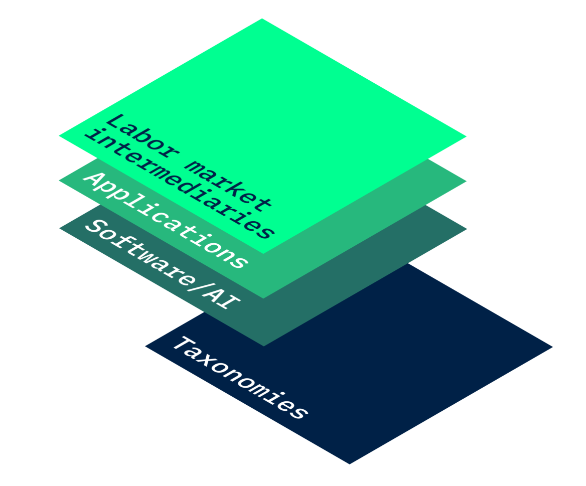
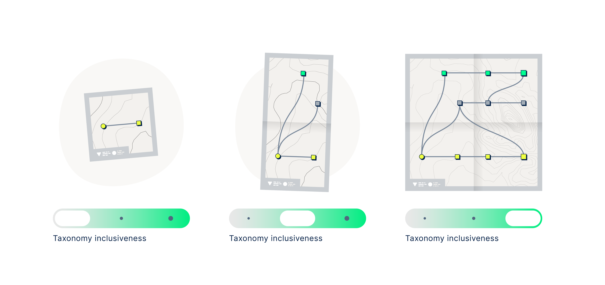

# Inclusive Livelihoods Taxonomy

<figure><figcaption>
 An inclusive reference taxonomy is the foundation for governments, nonprofits, and other actors to provide effective guidance on potential career pathways.
</figcaption></figure>

Human capital – the collective skills, knowledge, and experiences of an individual – is a significant determinant of economic productivity and income potential. The level of human capital an individual has often directly correlates with their ability to earn an income. It’s also deeply tied to the concept of human agency - the ability to make independent decisions and exert influence over one’s life. Working with our partners, we aim to make visible and usable the human capital of everyone in an economy.

The motivation for our work is described well by a quote from one our key partners, [Harambee Youth Employment Accelerator](https://www.harambee.co.za):

> _Young people in South Africa often lack the resources, networks, education and work experiences needed to be considered for formal employment. But, in the past 12 years, our work at Harambee has taught us that young people have the potential to perform in these jobs if we give them a chance! What if a young person was better able to identify and articulate the skills they have gained outside of the formal economy? What if they could signal skills gained from unpaid work?_
>
> _**Harambee Youth Employment Accelerator, South Africa**_

## Objectives

Organizations that help young people access economic opportunities typically use structured frameworks to describe the universe of opportunities in an economy and the anatomy of each opportunity – the mix of skills, competences, qualifications required.&#x20;

Traditional frameworks to measure economic activity and describe labor markets typically overlook significant areas of human capital investment and productivity such as household work for own production (e.g., cooking, cleaning, and childcare), volunteer work, and informal work. These activities form important parts of individual livelihoods and contribute significantly to human capital, but they are often undervalued or ignored because they do not involve direct monetary transactions.&#x20;

The objective of our work is to **make visible and usable the human capital of everyone in an economy**. Human capital here is defined as the skills, knowledge, and experience of individuals that can be used to create economic value.&#x20;

This involves two related efforts:

1. **Making visible** all economic activity and the skills, knowledge, and experience gained through these activities, including and especially in the traditionally “unseen” parts of an economy (i.e. the informal economy, unpaid household work, etc.).&#x20;
2. **Making usable** the skills, knowledge, and experience gained through these activities by organizing and integrating them into traditional frameworks of economic activities.&#x20;

***

The first objective will be accomplished through social science research and primary data collection following a common methodology described outlined below. The second objective will be accomplished by creating an inclusive reference taxonomy that partners can adapt and build upon. Our reference taxonomy can be accessed, adapted, and updated through our [Open Taxonomy Platform](open-taxonomy-platform.md).

## Outcome: An Inclusive Reference Taxonomy as Basis for Labor Market Intermediation and Analysis

A reference taxonomy offers a common language for understanding, categorizing, and linking different pieces of labor market information. It is a structured system of classification that aids in the interpretation and analysis of vast and diverse data sets in the labor market. Such a taxonomy can be seen as a map of the entire labor market. It describes the universe of jobs in an economy and the anatomy of each job – the mix of skills, competences, qualifications required for the job.&#x20;

This taxonomy is the foundation for governments, nonprofits, and other actors to provide effective guidance on potential career pathways and other services. The dropdown box below provides an overview of various use cases.&#x20;

Four key use cases for a reference taxonomy

1. **Matching**: A reference taxonomy helps to match the supply and demand sides of the labor market. For example, it can identify overlapping skills or qualifications between what employers are looking for in a job posting and what a job seeker has listed on their CV. By creating a system where these skills and qualifications are standardized and categorized, it's much easier to match job seekers to suitable job vacancies.
2. **Career Guidance and Skill Development Pathways**: A reference taxonomy can be used for tailored guidance to jobseekers, as it provides clear pathways for career development. It can highlight the skills or qualifications required for certain roles, or suggest alternative roles where similar skills or qualifications are required.
3. **Data Analysis and Interpretation**: When the skills, qualifications, and job titles are classified in a standardized way, it becomes possible to analyze and interpret the labor market data in a meaningful way. This could be for the purpose of understanding labor market trends, the most in-demand skills, the industries with the most vacancies, and so forth.
4. **Policy Making and Research**: A standard classification system can also support policy making and research by providing a consistent way of comparing data across different industries, geographical regions, and over time. This can support labor market forecasting, planning for education and training, and developing workforce development strategies.

## Problem: Traditional Frameworks Overlook Parts of the Economy

Commonly used labor market taxonomies typically overlook many economic activities that generate important skills, knowledge, and experiences; they fail to accurately portrait the often complex and diverse livelihoods of people.&#x20;

One of the most widely used frameworks to think about economic activity in a structured way is the [System of National Accounts (SNA)](https://unstats.un.org/unsd/nationalaccount/sna.asp). It serves as an international statistical standard for the measurement of national economic activities, employed by many countries around the globe. The SNA traces its roots back to the works of 20th-century economists, who sought to systematize the understanding of economic activities through a structured set of separate accounts. The SNA typically includes quantifiable, market-based economic activities.&#x20;

The System of National Accounts: What does it include, what does it exclude?

The [System of National Accounts (SNA)](https://unstats.un.org/unsd/nationalaccount/sna.asp) serves as an international statistical standard for the measurement of economic activities. This methodological framework, employed by various countries around the globe, guides the production, interpretation, and use of internationally comparable economic statistics. The SNA's existence is predicated on the need to standardize and simplify the complex nature of economic transactions. It functions as an economic map, describing the interconnections between different economic actors (households, businesses, government), their activities (consumption, production, investment), and the overall performance of an economy.&#x20;

One key element in the SNA is the concept of the "production boundary." The production boundary delineates the transactions that are accounted for in the calculation of Gross Domestic Product (GDP) and other key economic indicators.&#x20;

<figure><figcaption></figcaption></figure>

However, several significant areas of human capital investment and productivity fall outside this boundary, such as household work for own production (e.g., cooking, cleaning, and childcare), volunteer work, and informal work. These activities form important parts of individual livelihoods and contribute significantly to human capital for millions of people around the world, but  are often undervalued or ignored because they do not involve direct monetary transactions. We call these activities the "unseen economy".&#x20;

Intuitively, "seen" activities are paid, and thus typically considered as work, whether they are formal or informal, if not illegal. "Unseen" activities include all productive activities, such as cooking for a family member, that are unpaid and thus typically not considered as work. One other way to qualify unseen activities is that they are unpaid activities, that one could pay someone else to do. Therefore, it does not include leisure, as one may not pay someone to enjoy leisure activities for them.&#x20;

Not making visible and usable human capital from the "unseen economy" can limit human agency in at least four ways

1. **Under-valuation of Skills and Experience**: Many skills and experiences gained in these unseen areas of the economy are valuable and transferable. For example, managing a household requires skills in budgeting, logistics, negotiation, and multitasking. However, if these activities are not recognized as productive, valuable work, people (typically women, who disproportionately take on unpaid household work) who have spent their time in these areas may find it harder to transition into paid employment or may not receive fair compensation for the skills they've developed. [Contreras et al. (2024)](#user-content-fn-1)[^1] showed that including lists of activities in households surveys increases measures of youth and female labour force participation compared to unsupervised self-reporting or proxy reporting. This results suggests that listing possible occupations and skills helps job-seekers identify their professional experinces and skills.&#x20;
2. **Limited Economic Opportunities**: By not recognizing and compensating these activities, individuals engaged in them are often left without financial resources, limiting their ability to invest in themselves (like getting education or starting a business). This situation can contribute to income inequality, poverty, and diminished social mobility, further restricting individual agency.
3. **Impediment to Policy Recognition**: If these activities are not counted in official economic measures, they are less likely to be considered in policy decisions. For example, policies designed to support workers often focus on those in paid employment and may overlook the needs of people who are engaged in unpaid work. This lack of policy recognition can limit access to support structures like social security, healthcare, or labor protections.
4. **Reinforcement of Gender Inequalities**: Globally, women tend to do more unpaid work than men, including caregiving and household chores. The undervaluing of this work reinforces gender inequality by limiting women's time and opportunities to participate in paid work or other activities that could enhance their skills and expand their options.

Recognizing and accounting for the human capital in the unseen parts of the economy is vital for accurately representing people's contributions to the economy, and providing a basis for policies that protect and support all forms of work, thereby enhancing individual agency.

## Our Approach: Expanding the Map

With Tabiya's Inclusive Livelihoods Taxonomy, we aim provide a more inclusive map of the labor market – one that includes activities from the "unseen economy." A more inclusive map of the labor market will allow more inclusive matching, the identification of more diverse career and skill development pathways, and richer data analysis. [A more detailed description of our methodology can be found here](methodology.md).

<figure><figcaption>
Partners that help young people find jobs typically use a taxonomy to describe the universe of jobs in an economy and the anatomy of each job. Such a “map” of the labor market can help young people find escalators and elevators to better livelihoods. If the map is incomplete or inaccurate, it may limit young people’s ability to find the right jobs. <strong>We aim to expand the map to include the full range of diverse livelihoods that young people pursue, including those in the "unseen economy".</strong>
</figcaption></figure>

[^1]: Contreras Gonzalez,Ivette Maria; Dinarte Diaz,Lelys Ileana; Palacios-Lopez,Amparo; Costa,Valentina; Romero Esteban,Steffanny.

    _Closing the Gaps : The Role of Screening Questions and Self-Reporting in Measuring Women’s and Youths’ Employment and Work (English)._ Policy Research working paper ; no. WPS 10773; RRR: PEOPLE; LSMSWashington, D.C. : World Bank Group. http://documents.worldbank.org/curated/en/099225105162442556/IDU11958474e1ebca149f21b9891f9c2a4db03ed

    \
    \

